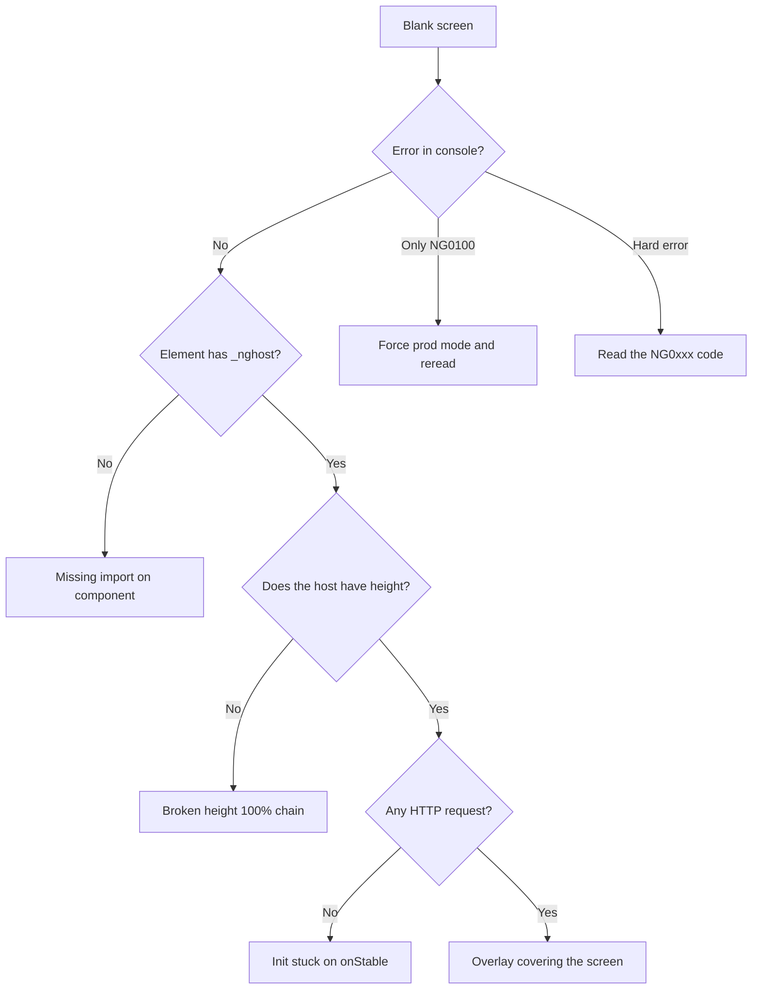

# Angular 16 → 21 Migration with AI

Sep 23, 2026 · @André Putz

## Context and scope

We took a high complex Angular app for a Capitole big Client to migrate the frontend from Angular 16 to Angular 21 in just 3 weeks, crossing five major versions and converting the codebase from NgModule to standalone in the same move. The main merge (PR 60723, 10 Aug 2026) touched 299 files: 19,752 lines added, 41,303 removed.

This is not an isolated SPA. The app consumes a set of private platform libraries, such as `@em2s/*`, `@aquaviz/*`, `@configurator/*`, published to an internal feed, which supply the shell, OIDC authentication, the gridster dashboard, the asset tree and the widget designers. That defines the nature of the problem: the migration did not depend on our code alone.

| Item | Before | After |
| --- | --- | --- |
| `@angular/core` | 16.2.11 | 21.2.18 |
| TypeScript | 4.9 | 5.9.3 |
| zone.js | 0.13 | 0.16.0 |
| Platform libs (`@em2s`/`@aquaviz`) | 4.12.7 (peer ng16) | 4.13.1-beta (ng21) |
| Grid | `@ag-grid-community/*` 28 | `ag-grid-angular` 35.1.0 |
| Modals / tooltips | ngx-bootstrap 16 | Angular Material (MatDialog, matTooltip) |
| Component architecture | NgModule + `declarations` | standalone with per-component `imports` |

The app has 72 components today: 59 already standalone declaring their own `imports`, 2 deliberately kept as `standalone: false`, and 14 surviving NgModules — the ones that still earn their place (feature routing, app bootstrap).

The real starting point was not "run `ng update` five times". It was waiting. The platform library only published an Angular 21 build on 22 July 2026 (`4.13.0-beta.20260722.3`); until then, any attempt to raise the app hit a `@angular/core: 16.2.11` peer pinned exactly in `package.json`. The three weeks start on that day.

## Why ng16 → ng21 is not an `ng update`

The cost of this migration is not in the compilation errors (by the way, it's the esiest part  to fix). It is in the changes that **compile clean and break at runtime, with nothing in the console**.

| Framework change | What it breaks in a mature ng16 app |
| --- | --- |
| standalone-by-default (ng19) | Every component without `standalone: false` is now standalone. It can no longer sit in `declarations` (NG6008), and the parent NgModule's `imports` **does not reach** its template( each component now needs its own list). |
| Lax template type-checking (project config) | A binding to a non-imported directive raises no error: it becomes an **inert element or attribute**. `<mat-menu>` renders inline and never opens; `<aqvz-asset-tree-view>` shows up empty. Zero console signal. |
| Hybrid CD scheduler (ng18+) | Change detection is no longer driven by NgZone. `zone.onStable.pipe(take(1))` and `onMicrotaskEmpty.pipe(take(1))` **never emit**, and that idiom is scattered across libraries written in the ng14–16 era. The component instantiates, shows its loader, and stops there. |
| `ngOnChanges` by reference | In-place edits to a configuration object (widget designer) no longer re-fire the hook. Derived options (Highcharts axes, thresholds) go stale. |
| `RendererFactory2` left the platform injector (ng17) | Any `providedIn: 'platform'` service that depends on it throws NG0201. It took down the whole of ngx-bootstrap 16's `BsModalService`. |
| Gutted NgModules | `@Injectable()` services without `providedIn` lose their provider and only fail when the view loads — late NG0201, one per view. |
| SCSS `@import` → `@use` | Partials relying on `@import`-era globals break; the easy way out ("drop it from `styles.scss` so the build passes") silently removes **all** of the app's global styling. |

Two practical consequences shape everything that follows.

First: the intermediate state is **mixed and legitimate**. After the conversion, the same module holds components that are already correctly standalone (with a complete `imports`) next to siblings that are standalone-by-omission (with no `imports` at all). Reverting the whole module re-declares the good ones and produces NG6008. There is no "roll it all back and redo" shortcut — the work is component by component.

Second: **the dominant symptom is a blank screen with no error**. It is not a stack trace to read, it is an absence to diagnose. That is where AI changed the game and also where it got most lost.

## The three weeks, phase by phase

The time did not distribute the way intuition suggests. Getting it to compile cost less than a third; the rest was getting it to **run**.

| Phase | Window | What consumed the time |
| --- | --- | --- |
| 0 — Blocked | until 22 Jul | Platform libs pinned at 4.12.7 (peer ng16). The app sat stranded on ng20.3.26 waiting. Waiting time, not work. |
| 1 — Compile | 22–29 Jul | Version bumps and \~16 mechanical errors (ag-grid package renames, `@aquaviz/core` API signatures, malformed imports), then \~79 template and module errors across 8 feature modules. Core commit: 53 files, +733/−2,423. |
| 2 — Boot | 29 Jul–5 Aug | The app compiled and served a blank page. Lost NgModule wiring (bootstrap, routes), a cascade of NG0303/NG0201/NG05105, ngx-bootstrap swapped for Angular Material, global CSS reconnected. |
| 3 — Stabilise | 5–10 Aug | Runtime behaviour: NG0100 flooding the dynamic widgets, blank screens with a correct DOM, runtime patches for library bugs. Merged 10 Aug. |
| 4 — Tail | 13 Aug–3 Sep | `provideZoneChangeDetection` in the bootstrap, widget designer bugs, live widget previews in custom dashboards. Five follow-up PRs after the merge. |

Phase 4 deserves an honest note: **the migration does not end at the merge**. The three weeks delivered a working, integrated app; another three weeks of scattered PRs cleaned up what only surfaces under real use of widget designers, live previews, dashboard edge cases. Any estimate that ignores that tail understates the project by roughly 40%.

The inflection point sits between phase 1 and phase 2. In phase 1 there is a list of errors: it shrinks, you can measure progress, you can parallelise. In phases 2 and 3 there is no list, because there is a blank screen and a clean console. That is precisely the kind of work you cannot estimate by counting files, and it is where the two scenarios in the next section diverge.

## With AI and without

With AI: 23 working days to a stable app in production. Without AI, the retrospective estimate is \~55 days — roughly 2.4x. The gain is not uniform: almost all of it sits in the diagnostic phases, not the typing ones.

&#91;embedded content: internal measurement · 4 phases · 1 developer\]

One caveat before the detail: this is the retrospective of **one** project, not a controlled experiment. The "with AI" column is measured (commits and dates); the "without AI" column is an estimate based on how long each diagnosis took once found, plus the path we would have walked without the shortcut.

### Where AI genuinely won

1. **Reading compiled libraries.** The single largest gain. Two broken screens were library bugs, not ours. Finding a `zone.onStable.pipe(take(1))` at around line 4532 of a minified `fesm2022/*.mjs` is work a human rarely attempts — you give up first and file a vague ticket. The AI read the bundle and returned root cause, file and line. That became an actionable ticket for the platform team and a runtime patch on our side, instead of weeks of waiting.
2. **Applying one diagnosis at scale.** The first NG0303 cost real time; the next 40 were mechanical. The AI walks all eight feature modules, reads every template, and returns the exact list of missing `imports` per component.
3. **Cheap parallel hypotheses.** On a blank screen with no error, testing five theories costs five rounds of human investigation. With AI, four of them are eliminated in minutes by reading code.
4. **Documenting while solving.** Every diagnosis became a persistent note. That knowledge — normally lost in Slack — is what made this article possible, and what will make the second migration cost half the first.

### Where AI cost time

1. **It chased the loudest error.** A blank screen with a flood of NG0100 in the console: we spent about a day refining change detection. The real blocker was a single `TypeError` buried under the noise. NG0100 is dev-only and blanks no screen — the AI knew that and still followed the volume.
2. **It built a false rule and trusted it.** After several cases of "missing import ⇒ loud NG0303", the AI started **ruling out** the missing-import hypothesis whenever the console was quiet. The blank dashboard was exactly that, silently. Hours lost descending through data, translation, CSS and gridster configuration.
3. **It invented a workaround that did not work.** A `NgZone` keep-alive on a `setInterval` to force `onMicrotaskEmpty` to keep emitting. Plausible on paper, inert in practice, reverted.
4. **It does not weigh maintenance cost on its own.** The first proposal for the library bug was a local subclass — which would have duplicated the vendor's template and forfeited future updates. The tech lead rejected it, and the solution became a prototype override isolated in one file, removable once upstream fixes it. Architectural decisions stay human.

## The ng21 defect catalogue

Every defect below was found in this project. Grouped together, they form a diagnostic tree: when a screen fails to render, the first question is not "which error?", it is "did the component ever come alive?".



The `_nghost` question is the highest-yield one and costs ten seconds in DevTools. A standalone component whose template uses a non-imported element renders that element as an **inert unknown tag**: present in the DOM, no `_nghost` attribute, empty inside, and frequently **no error at all**. It happened with the dashboard, the asset tree and the notifications tab — three times, and all three times we burned hours on data theories before checking the element's identity.

### Silent failures (the expensive ones)

| Symptom | Root cause | Fix |
| --- | --- | --- |
| Element in the DOM, no `_nghost`, empty, no error | Standalone component missing the child or module in its own `imports` | Add it to the **component's own** `imports` — a sibling NgModule's `imports` does not reach it |
| `<mat-menu>`/`<mat-select>` render inline and never open | `MatMenuModule`/`MatSelectModule` missing from the component's `imports` | Import in every component, including the child, not just the trigger's host |
| Modal appears, but unpositioned and without a backdrop | `@angular/cdk/overlay-prebuilt.css` not loaded | `@use` the CDK stylesheet in `styles.scss` |
| App-wide global styles gone (bullets with no colour) | `app.scss` orphaned during the `@import` → `@use` migration | Migrate the partials to `@use 'theme-configuration' as *` and rewire `app.scss` |
| Empty dashboard with correct backend JSON | Broken `height: 100%` chain; `gridster-column` at 2px; the lazy-loading IntersectionObserver never fires | `display: block; height: 100%` from the sized ancestor down; or `lazyLoading=false` |
| Blank screen with the whole DOM tree present and correct | A field initialised as `{} as T` — truthy — triggers a full-screen overlay `*ngIf` | Default to `null`; audit every `= {} as X` left behind by `strictPropertyInitialization` |
| Loader forever, no HTTP and no error | Library initialises inside `zone.onStable.pipe(take(1))` / `onMicrotaskEmpty.pipe(take(1))`, which never emits under ng21 | Isolated prototype override imported before bootstrap; ticket to the vendor |
| Tree that only refreshes on the next click | The library's async load does not schedule change detection | `tap(() => setTimeout(() => appRef.tick()))` on the library's loader |

### Coded errors (the cheap ones)

| Symptom | Root cause | Fix |
| --- | --- | --- |
| Completely empty page, no `<aap-root>` | `bootstrap: [AppComponent]` removed from `AppModule` | Re-declare the component as `standalone: false` and restore the array |
| Feature route never matches, `router-outlet` empty | `RouterModule.forChild(AppRoutes)` removed from the feature module | Rewire `forChild` and declare the entry component |
| NG0303 `Can't bind to 'ngIf'` | Standalone component missing `CommonModule` (or `TranslateModule`) in `imports` | Add it to the component's `imports` |
| NG05105 `Unexpected synthetic property` | `BrowserAnimationsModule` dropped from `AppModule` | Restore the module (the app bootstraps via NgModule) |
| NG0201 `No provider found` | `@Injectable()` without `providedIn`, orphaned by a gutted module | `@Injectable({providedIn:'root'})` |
| NG0201 via `providedIn: 'platform'` | `RendererFactory2` left the platform injector in ng17 | Provide at app root (`ModalModule.forRoot()`) or replace the library |
| NG6008 when reverting a module | The module contains components that are **already** correctly standalone | Never revert a whole module; fix component by component |
| `Cannot find control with name: 'X'` | Empty `new FormGroup({})` rebuilt in `ngOnInit` | Declare the controls in the field initialiser and use `patchValue` |
| NG0100 flooding the screen on dynamic widgets | Widgets created via `createComponent` load data and mutate bound state inside the host's CD pass | `cdr.detach()` in `ngOnInit` + `detectChanges()` after each async update |
| NG0100 `-1 -> N` on `WidgetHostComponent` | Gridster auto-positions a widget with no saved `gridPosition` and writes back into the bound object | Benign, dev-only; the real fix is the backend sending a position |
| NG0100 `-1 -> N` on `AssetTreeNodeComponent` | Our own forced `tick()` on a microtask straddled a half-populated `@for` | Swap `queueMicrotask` for `setTimeout` (macrotask) |
| Widget draws "some things but not all" after a designer edit | `ngOnChanges` does not re-fire on in-place edits; derived options (axis min/max) go stale | Recompute the derived option where the data is computed, not only at chart creation |

### Two tooling tricks worth days

**`NO_COLOR=1` on the build.** From ng18 on, the toolchain emits one enormous coloured string and `colorette` blows the stack with `RangeError: Maximum call stack size exceeded` — before printing any real error. `--stack-size` does not help. With `NO_COLOR=1` the colour functions become no-ops and the genuine errors appear.

**Force `enableProdMode()` early.** On a blank screen with an NG0100 flood, switching prod mode on temporarily in `main.ts` disables `checkNoChanges` (which only exists in dev) **while keeping the development backend** — the environment comes from file replacement, not from that flag. With the noise gone, the hard error that was hiding stands out on its own. Do this in the first hour, not at the end of the day.

## Prompts that worked

The good prompts all share one shape: **raw evidence, one constraint, and a ban on editing before diagnosing**. The texts below are representative reconstructions of what we used, not literal transcripts.

**1. Diagnose first, do not reach for the code**

```text
The /wa/efw/plant screen is blank. Pasted below:
(a) the entire console, unfiltered;
(b) the DOM from <efw-plant-performance-challenges> down;
(c) the Network tab for that navigation.

Before proposing any fix: tell me the FIRST thing to check and why it
discriminates between the hypotheses. Do not edit any files.
```

Why it works: the DOM is the only source of truth that separates "never rendered" from "rendered and covered". Asking for the **discriminating test** before the fix is what stops the AI from buying its first theory.

**2. Send it into the compiled library**

```text
This component belongs to @aquaviz/dashboard, it is not our code.
Read src/node_modules/@aquaviz/dashboard/fesm2022/aquaviz-dashboard.mjs
and find where AssetSelectorPanelComponent sets treeId.
I want the line number and the literal snippet, not a summary.
Then tell me whether that init path can fail to run under ng21.
```

Why it works: the AI does not "know" what the library does — but it reads 20,000 lines of bundle without tiring. Demanding a line number and a literal snippet defeats hallucination: either the snippet is there or it is not.

**3. Apply a validated rule at scale**

```text
Confirmed rule: every component without `standalone: false` is standalone
and must import, in its OWN imports array, everything its template uses.
A sibling NgModule's imports does not count.

Sweep src/app/shared/views/**/*.component.ts and return a table:
file | elements and directives in the template | what is missing from imports.
Do not edit yet.
```

Why it works: it separates diagnosis from execution. A 40-row table is reviewable in two minutes; 40 edits straight into the code are not.

**4. Constrain the solution before asking for it**

```text
Do not fork the component and do not use patch-package — both forfeit
vendor updates. The fix must fit in a single file of ours, removable the
day upstream ships a fix. Under that constraint, what are the options?
```

Why it works: the AI optimises for "solve it now". Maintenance cost only enters the calculation if you put it there. Here the answer was an isolated prototype override loaded before bootstrap.

**5. Unmask the real error**

```text
Ignore the NG0100s for now: they are dev-only and blank no screen.
Turn on enableProdMode() in main.ts behind a temporary flag, run again,
and tell me which HARD error is left in the console.
```

Why it works: it re-prioritises explicitly. Without it, the AI follows message volume rather than severity.

**6. Close the learning loop**

```text
Before moving to the next screen: record what we just found as a reusable
note — observable symptom, root cause, how to recognise it again, and what
I tried earlier that did NOT work.
```

Why it works: this is the highest compounding return of the lot. Each of those notes shortened the next diagnosis, and they are what became the catalogue in the previous section.

### Antipatterns that cost us

| Prompt | What happens |
| --- | --- |
| "Migrate this module to standalone" | You get a plausible result that removes wiring without a replacement: the app's `bootstrap` and `RouterModule.forChild` disappeared exactly this way, and cost us all of phase 2 |
| "The screen is blank, fix it" | The AI picks the most interesting hypothesis and starts editing. You find out hours later that it was in the wrong layer |
| "Why is this NG0100 happening?" | It invites an explanation of the visible error. The right question is "is this error the blocker, or just the loudest?" |
| "Update all the dependencies" | Without saying that the platform libs dictate the Angular version, you get an incoherent `package.json` and a day of rollback |
| "Is it working now?" | The AI answers for what the code ought to do. Replace with "give me the command that proves it" |

## The method, in eight steps

This is the order we would use again. It differs from the order we actually followed — steps 2 and 6 were learned the hard way.

1. **Find out who dictates the version, before anything else.** In an app consuming internal libraries, the ceiling is their `peerDependency`, and it is pinned exactly. If the vendor has not published a build for your target version, the migration **has not started** — what you have is a date to negotiate. We found this out late and the app sat on a useless intermediate version.
2. **Make the build fail legibly.** Before any fix, make sure the error you read is the error that exists. Colours, spinners and progress bars from the toolchain break on new versions and mask everything (`NO_COLOR=1`). Without this you debug the tooling, not the code.
3. **Write the migration's `CLAUDE.md` before the first line.** Detailed in the next section. It is the difference between the AI proposing "fork the library" and proposing the solution you would actually accept.
4. **Bump versions in an isolated commit and let the error list grow.** Do not fix while bumping. You want a complete inventory before you start spending decisions, and a clean point to return to.
5. **Batch mechanical work, with review before editing.** Package renames, changed API signatures, malformed imports. Always in the form "give me the table of what you will change; do not edit yet". Reviewing a 40-row table takes two minutes; reviewing 40 diffs does not.
6. **Restore runtime wiring before hunting any bug.** Bootstrap, routes, `BrowserAnimationsModule`, `providedIn: 'root'` services. Then run the app **once** and read the whole console top to bottom without fixing anything. Most NG0xxx codes name the exact file; it is the cheapest harvest of the project.
7. **One screen at a time, with a fixed diagnostic tree.** Force prod mode early to unmask hard errors; then `_nghost` → height → HTTP → overlay, in that order. Golden rule: **no edit before a test that discriminates between hypotheses**.
8. **Separate "our bug" from "library bug", with proof.** When the trail enters `node_modules`, have the bundle read and demand a line and a literal snippet. With the proof in hand there are three honest exits: an isolated, removable patch; a ticket to the vendor; or accepting the behaviour. Without the proof there is only the fourth: guessing at your own code for days.

### Regression sweep at the end

Before calling it done, search for the patterns the migration itself plants. Each of these produced at least one production bug here.

| Search for | Why |
| --- | --- |
| ` = {} as  ` | `strictPropertyInitialization` placeholder; truthy, breaks `*ngIf` and lazy-creation guards |
| `new FormGroup({})` | Empty group rebuilt in `ngOnInit` → `Cannot find control` |
| `onStable`, `onMicrotaskEmpty` | Init gates that no longer fire — in your code **and** in `node_modules` |
| `@Injectable()` without `providedIn` | Late NG0201 when the view that uses it loads |
| `providedIn: 'platform'` | Services that lost access to the application injector |
| Components with no `imports` and no `standalone: false` | Standalone by omission, inert template, zero errors |

And define "done" with the tail included: the merge is not the end. Explicitly reserve another round of PRs for what only shows up under real use.

## What context to feed it

Output quality tracked input quality almost linearly. Three layers, in order of return.

### 1. The migration's `CLAUDE.md`

Written before the first line of code and updated as the state changes. What made the difference here:

```markdown
## Baseline
From ng16.2.11 to ng21.2.18. TypeScript 5.9.3, zone.js 0.16.0.
The version ceiling is dictated by the internal libs (@em2s/*, @aquaviz/*),
pinned exactly. Never raise @angular/* beyond their peer.

## Commands
Build: NO_COLOR=1 npm run build:client   (without NO_COLOR the toolchain
                                          blows up before printing an error)
SCSS:  node src/node_modules/sass/sass.js src/src/styles.scss ...

## Where to look when the trail leaves our code
Library bundles: src/node_modules/@aquaviz/*/fesm2022/*.mjs
Read the bundle and cite the line. Do not assume what the library does.

## Inviolable rules
- No forking vendor components and no patch-package.
  Library fixes live in src/app/core/library-fixes/, removable.
- Never revert a whole module: the state is mixed, some components are
  already correctly standalone. Fix them one at a time.
- The app bootstraps via NgModule (bootstrapModule, not
  bootstrapApplication). Use modules, not provideX().
- No claim that something "works" without the command or evidence proving it.

## Selector prefixes
aap- and efw- = our code | aqvz-, ews- = platform libraries
```

The inviolable-rules block is the part that pays most. Without it, the AI proposes the technically correct and organisationally unacceptable solution — and you spend the next round explaining why not.

### 2. Persistent memory, one note per defect

Every closed diagnosis became a note with four fields. The fourth is the one almost everyone forgets, and the most valuable:

- **Observable symptom** — what you see, not what you conclude ("tab renders its headings, bodies empty")
- **Root cause** — file, line, mechanism
- **How to recognise it again** — the ten-second test
- **What I tried that did NOT work** — otherwise the AI proposes the same dead end two weeks later

That is exactly what happened with the `NgZone` keep-alive: recorded as "tried, failed, do not repeat". Without the note it would have been proposed again.

### 3. Runtime context — the part only you have

The AI does not open a browser. Everything behind DevTools you have to hand over, **raw**:

- The **entire** console, unfiltered. The error that matters is usually buried under noise, and filtering is precisely deciding in advance which one matters.
- The DOM subtree with attributes, copied, not described. `_nghost`, a `gridster-column` at `height: 2px`, an empty `<!--container-->`: those details close the case and no prose description contains them.
- The Network tab — including when it is empty. "No request at all" is one of the strongest signals there is: it means init never ran.
- The actual backend payload, when data is the suspect.

### What to deliberately withhold

**Your theory stated as fact.** Saying "I think it's gridster" makes the AI adopt the hypothesis and stop looking. Say "my hypothesis is gridster; what test rules it out?".

**The narrative history of everything you tried.** Give the short list of what was **ruled out and why**. The long narrative burns context and still nudges the AI down your path.

**Huge diffs with no question.** Pasting 2,000 lines of diff without saying what to look for produces a polite summary of the diff.

## What AI did not solve

The 2.4x gain came with new work attached, and it is worth naming because it never shows up in estimates.

**Architectural decisions stay human.** Fork the component or override the prototype? Accept gridster's auto-layout or demand a position from the backend? The AI presents the options well and chooses badly — because it optimises for today's problem and carries none of 2027's maintenance cost.

**Domain knowledge is not in the code.** In more than one case a "bug" was intentional product behaviour — for example, a drop in the designer that replaces the user's thresholds, because the asset KPI is the source of truth. Without someone who knows the product, the AI competently fixes what was not broken.

**The AI does not see the screen.** Overlays, collapsed heights, wrong colours, an arc drawn at zero width: all of it reached the model because a human looked and copied the DOM. Several diagnoses were bottlenecked on a person, and will stay that way.

**It reports success too early.** "That should work now" was said many times before it worked. The posture that succeeded was turning every claim into a demand for evidence: which command, which output, which screen.

**It generalises from few cases and then trusts its own rule.** The most expensive episode of the migration was exactly this — the rule "a missing import is loud" made the AI discard the right answer. A human would have the same tendency; the difference is that the AI expresses it with great confidence and speed.

**And it does not negotiate a release with the platform team.** Phase 0 — weeks waiting for the ng21 build of the libraries — is accelerated by no tool at all.

### The supervision cost

The developer's role shifts from "write the fix" to "define the discriminating test and review the table before it is applied". That is denser work, not lighter work. Anyone treating AI as an autonomous executor on a migration like this becomes a reviewer of plausible code — and plausible code is exactly what produces a blank screen with a clean console.

## Pocket checklist

To paste at the start of the next large migration.

**Before starting**

- [ ] Identified who dictates the version ceiling and confirmed a build exists for the target version
- [ ] The build fails with a legible message (toolchain colours and spinners off)
- [ ] `CLAUDE.md` written: baseline, commands, path to the library bundles, inviolable rules
- [ ] Agreed with the team that the merge is not the end — a tail of PRs is reserved

**During**

- [ ] Version bumps landed in an isolated commit, with no fixes mixed in
- [ ] Every batch change went through a reviewed table before any edit
- [ ] Runtime wiring restored before hunting behavioural bugs
- [ ] Prod mode forced in the first hour of each blank screen, not the last
- [ ] No edit without a test that discriminates between hypotheses
- [ ] When the trail entered `node_modules`, demanded the line and literal snippet from the bundle
- [ ] Every closed diagnosis became a note — including what did **not** work

**Before calling it done**

- [ ] Swept for the patterns the migration plants (` = {} as  `, `new FormGroup({})`, `onStable`, `@Injectable()` without `providedIn`, components with no `imports`)
- [ ] Every screen opened in the browser with a clean console, not just a green build
- [ ] Library bugs filed with the vendor, with root cause and line number
- [ ] Library patches isolated in their own directory, with a comment saying when to remove them

